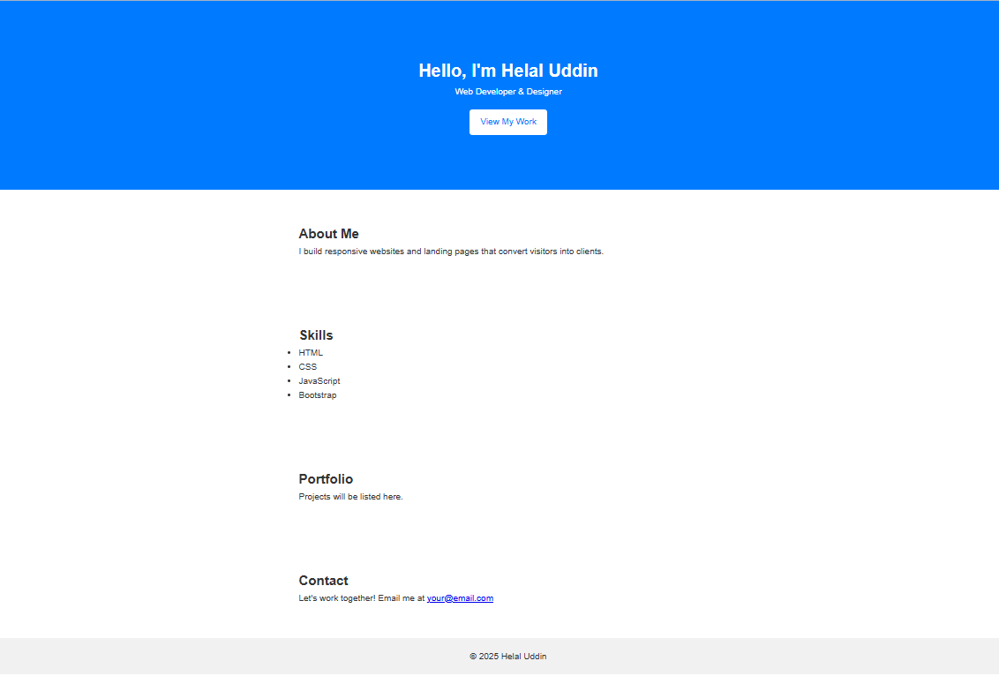

# 🎨 Modern Portfolio HTML Template

A clean and professional portfolio template built with HTML, CSS, and a touch of JavaScript. Ideal for developers, designers, freelancers, and creatives who want to showcase their work and personal brand online.

## ✨ Features

- Fully responsive and mobile-friendly
- Modern and clean UI design
- Sticky navigation and smooth scrolling
- Animated project section
- Contact form ready (can be integrated with Formspree or other tools)
- Easy to customize code structure

## 📁 Files Included

- `index.html` – Main homepage layout
- `style.css` – Styling and responsiveness
- `script.js` – Interactivity and animations
- `/assets/` – All images and icons
- `README.md` – Project overview and instructions

## 🚀 Live Preview

> (You can upload and host this template on GitHub Pages or Netlify to view a live demo.)

## 🛠️ How to Use

1. Download or clone the repository.
2. Open `index.html` in your browser to preview.
3. Edit HTML and CSS to add your content and style.
4. Upload to your hosting or GitHub Pages.

## 📸 Preview

## 📬 Connect With Me

- [Facebook](https://facebook.com/helaluddin24hb)
- [LinkedIn](https://linkedin.com/in/helalbd)
- [Fiverr Profile](https://www.fiverr.com/s/zWNPp2z)

---

## 📜 License

This template is free for personal and commercial use. No attribution required, but appreciated.

---

Made with ❤️ by Helal Uddin
